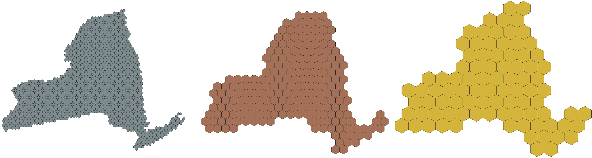

```{r setup, include=FALSE}
library(kableExtra)
options(htmltools.dir.version = FALSE)
knitr::opts_chunk$set(
  fig.width=9, fig.height=3.5, fig.retina=3,
  out.width = "100%",
  cache = FALSE,
  echo = FALSE,
  message = FALSE, 
  warning = FALSE,
  fig.show = TRUE,
  hiline = TRUE
)
xaringanExtra::use_webcam()
```

```{r xaringan-themer, include=FALSE, warning=FALSE}
library(xaringanthemer)
style_duo_accent(
  primary_color = "#26375b",
  secondary_color = "#27686d",
  inverse_header_color = "#FFFFFF"
)
```

background-image: url("splash.png")
background-size: contain

---

# About Me

.pull-left[

- Mike Mahoney

- PhD Student at SUNY-ESF and ESIP Community Fellow

- Focusing on visualization, VR and ML as ways to think about large-scale systems

- Background in landscape and community ecology

- https://mm218.dev

]

.pull-right[

```{r, echo=FALSE}
knitr::include_graphics("https://github.com/mikemahoney218.png")
```

]

---

## New York State 2019 CLCPA:

.pull-left[

### • 85% Reduction in GHG emissions by 2050  

### • Net zero emissions statewide by 2050

### • Lands & forests make up the difference

]

.pull-right[

```{r}
knitr::include_graphics("forest.jpg")
```

]

<br /> 

???
Climate Leadership and Community Protection Act

---

## Key questions:

### • How much carbon is stored in our forest land?

### • How is the amount of carbon stored changing over time?

### • Where should we target reforestation and preservation?

---

```{r}

```

<p style="font-size:8px">Figure from Shirer, R. and Zimmerman, C. (2010) Forest Regeneration in New York State. The Nature Conservancy.</p>

---

# If you can't measure it, you can't manage it.

<br />

# How can remote sensing and AI / ML help fill in the gaps?

---

```{r out.width="100%"}

```

???
NY has a temporal patchwork of airborne LiDAR data available 

---

## Our framework:

### • Use airborne LiDAR to generate point-in-time estimates where available

### • Use spaceborne RS data to extrapolate beyond those boundaries

---
class: inverse center middle

# Putting the Framework in Action

### Are we seeing a net growth of forests?

---
class: center middle

```{r out.width="75%"}

```


---

### Point-in-time estimates from airborne LiDAR

<br />

```{r out.width="100%"}

```

---

## Modeling approach:

### • Ensemble modeling approach

### • Linear regression combining predictions from:

  + Random forest 

  + Gradient boosting machine

  + Support vector machine

<br />

### • Ensembling improves predictive accuracy, lets us try many models but present a single prediction

---

```{r out.width="100%"}

```

---

## Map accuracy across scales

```{r out.width='100%'}
dplyr::tribble(
  ~ "Scale", ~ "RMSE", ~ "MBE", ~ "R2", 
  "Plot-pixel comparison", 39.60, 1.88, 0.76,
  "8,660 ha hex", 33.27, 3.56, 0.76,
  "78,100 ha hex", 23.38, 1.64, 0.80,
  "216,500 ha hex", 21.17, 0.75, 0.81
) |> 
  kbl() |> 
  kable_styling(bootstrap_options = "striped")
```

<br />

```{r out.width="100%"}

```

---

## Use spaceborne RS to extrapolate

<center>

```{r out.width="85%"}
knitr::include_graphics("Screenshot from 2022-01-18 19-47-27.gif")
```

</center>

---

## Assess changes in pixels over time

```{r out.width="100%"}

```

---

```{r out.width="100%"}

```

---
class: inverse center middle

# Putting the Framework in Action

### Where should we prioritize reforestation?

???
Use LiDAR to identify areas of "marginal forest" -- areas that would _become forest quickly_

---

## Where should we prioritize reforestation?

### • One thought: prioritize areas that are naturally regenerating

### • Target young forests & abandoned fields for preservation and supplemental reforestation

---

### Point-in-time estimates from airborne LiDAR

```{r out.width="85%"}
knitr::include_graphics("lidar_shrubland.png")
```

---

## Modeling approach:

### • Ensemble modeling approach

### • Logistic regression combining predictions from:

  + Random forest 

  + Gradient boosting machine

  + Neural network

<br />

---

```{r out.width="95%"}
knitr::include_graphics("lidar_predictions.png")
```

---

```{r out.width="95%"}
knitr::include_graphics("2019_statewide_predictions.png")
```

---

```{r out.width="95%"}
knitr::include_graphics("2019_booleans_retouched.png")
```

---

## FAIRness Challenges

### 1. How can we easily incorporate new data streams into this workflow?

### 2. How can we make these products the most useful they can be for our stakeholders?

---

# Thank you!

This work was financially supported by the Climate & Applied Forest Research Institute at SUNY-ESF.

<br />

#### Find me online:

`r icons::fontawesome("github")` [@mikemahoney218](https://github.com/mikemahoney218/) 

`r icons::fontawesome("twitter")` [@mikemahoney218](https://twitter.com/mikemahoney218/) 

`r icons::fontawesome("globe")` [mm218.dev](https://mm218.dev)

<br />


